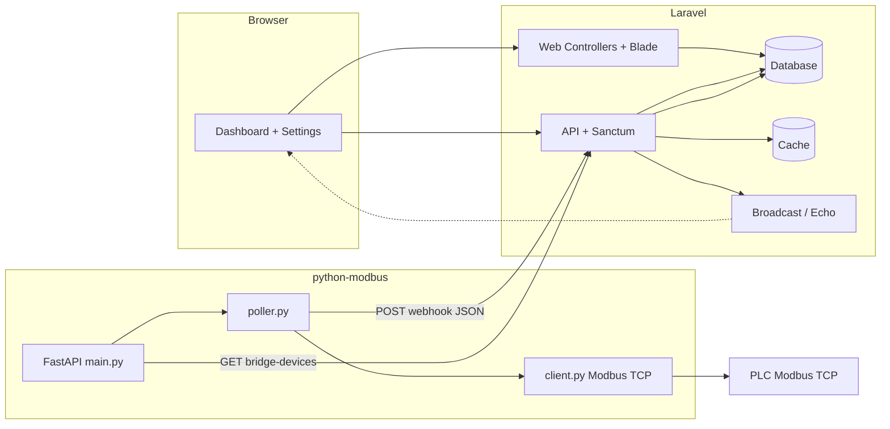

# Penjelasan cara kerja sistem SPM SCADA (tampilan & internals)

Dokumen ini menjelaskan **alur dari awal sampai akhir** dalam dua sudut pandang:

1. **Sisi luar (website / pengguna)** — apa yang dilihat dan dilakukan operator.
2. **Sisi dalam (kode & sintaks)** — file, endpoint, dan rantai eksekusi utama.

---

## 1. Gambaran arsitektur

- **Satu sumber kebenaran untuk parameter koneksi PLC di aplikasi web** adalah tabel **`plc_devices`** (diubah lewat halaman Settings).
- **Python** mendapatkan salinan parameter itu saat startup lewat **`GET /api/plc/bridge-devices`** jika `LARAVEL_BRIDGE_DEVICES_URL` diisi; jika tidak, memakai **`python-modbus/config.py`** dan env `PLC_xx_IP`, `PLC_DEFAULT_UNIT_ID`, dll.

---

## 2. Sisi luar: alur pengguna (start → finish)

### 2.1 Masuk ke sistem

1. Pengguna membuka URL aplikasi (mis. `http://127.0.0.1:8000` atau via dev server Vite).
2. Jika belum login, middleware Laravel mengarahkan ke **`/login`** (`routes/web.php`, grup `guest`).
3. Form login mem-post kredensial; setelah sukses, sesi web aktif dan pengguna diarahkan ke **dashboard** (`/`).

**File terkait (web):**

- `routes/web.php` — rute `login`, `logout`, `/`, `/settings/plc`.
- `app/Http/Controllers/Web/AuthController.php` — proses login/logout.

### 2.2 Dashboard (tampilan utama)

1. Setelah login, rute **`/`** memuat halaman dashboard (Blade + aset Vite).
2. JavaScript memuat data agregat ruang kontrol dan utilitas lewat **API** (`GET /api/dashboard`) menggunakan token **Laravel Sanctum** (biasanya dari cookie/session SPA atau mekanisme yang dipakai `AuthService`).

**Perilaku UI utama:**

- Pengguna memilih **control room** dan **testing room** (pit/cell).
- Panel kanan menampilkan status, log peristiwa, dan visualisasi (termasuk adegan Three.js pada elemen peta).
- Jika variabel lingkungan **`VITE_PUSHER_APP_KEY`** (dan konfigurasi Echo) aktif, frontend berlangganan channel **`plc.room.{roomId}`** dan mendengarkan event **`.PlcRoomUpdated`** untuk memperbarui data PLC tanpa memuat ulang seluruh halaman.

**File terkait (frontend):**

- `resources/views/dashboard.blade.php` — kerangka HTML dashboard.
- `resources/js/dashboard/main.js` — logika tab, pemilihan ruang, **`bindPlcEchoForRoom`**, integrasi data.
- `resources/js/dashboard/init.js` — inisialisasi (termasuk Three.js / peta).
- `resources/js/services/dashboardData.js` — **`getDashboardData()`**, **`PlcAPI.getRoomData`**.
- `resources/js/services/authService.js` — token / pemanggilan API.
- `resources/css/dashboard.css` — gaya termasuk halaman Settings.

### 2.3 Settings — koneksi PLC

1. Dari header/sidebar, pengguna membuka **`/settings/plc`** (hanya pengguna terautentikasi).
2. Halaman menampilkan kartu per **PLC device** (grouped pits/cells): IP, port, **unit ID (slave)**, enabled, status, nama device yang selaras dengan nama ruang uji.
3. Menyimpan perubahan mengirim **HTTP PUT** ke Laravel (`settings.plc.update`) untuk device yang dipilih; server memvalidasi dan memperbarui baris **`plc_devices`**.

**Implikasi operasional:** nilai **unit_id** di sini harus sama dengan **Unit ID** di PLC fisik. Setelah disimpan, bridge Python yang memakai **`LARAVEL_BRIDGE_DEVICES_URL`** akan membaca nilai baru **pada startup berikutnya** (restart uvicorn agar map device ter-refresh).

**File terkait:**

- `app/Http/Controllers/Web/PlcConnectionController.php`
- `resources/views/settings/plc-connection.blade.php`
- `resources/views/settings/partials/plc-device-card.blade.php`

### 2.4 Peran operator vs admin

- **Middleware `role`** pada beberapa rute API (mis. alarm acknowledge, admin users) membatasi aksi.
- **Middleware `room.access`** membatasi akses data ruang tertentu sesuai assignment user (control room).

**File terkait:**

- `app/Http/Middleware/RoleMiddleware.php`
- `app/Http/Middleware/RoomAccessMiddleware.php`
- `bootstrap/app.php` — registrasi alias middleware.

---

## 3. Sisi dalam: rantai data PLC (start → finish)

### 3.1 Konfigurasi device di database

- Model **`App\Models\PlcDevice`** merepresentasikan satu PLC per **`testing_room_id`** (isi awal dari **`database/seeders/DatabaseSeeder.php`**).
- Field penting: `ip_address`, `port`, `unit_id`, `is_enabled`, `status`, `last_seen_at`.

### 3.2 Startup bridge Python

1. **`python-modbus/main.py`** memuat **`.env`** (path eksplisit di folder `python-modbus`).
2. Jika **`ENABLE_POLLING`** aktif, pada **lifespan** FastAPI:
   - **`load_plc_devices_sync()`** (`modbus/device_loader.py`):
     - Jika **`LARAVEL_BRIDGE_DEVICES_URL`** ada: **HTTP GET** ke Laravel → JSON `{ ok, devices: { "1": { ip, port, unit_id, name }, ... } }` hanya untuk **`is_enabled = true`**.
     - Jika gagal atau URL kosong: fallback ke **`config.PLC_DEVICES`**.
   - **`set_plc_devices(...)`** (`modbus/poller.py`) mengisi map in-memory **`_plc_devices`**.
   - **`start_polling()`** memulai loop async.

### 3.3 Polling Modbus

1. **`poll_all()`** memanggil **`poll_single(room_id)`** untuk setiap kunci di **`_plc_devices`** secara paralel.
2. **`read_plc_registers`** (`modbus/client.py`):
   - Membuka **AsyncModbusTcpClient** ke **`plc_config["ip"]`** dan **`plc_config["port"]`**.
   - Membaca **holding registers** mulai **PDU address `REGISTER_START` (0)** sebanyak **`REGISTER_COUNT` (12)** dengan **slave/unit = `plc_config["unit_id"]`**.
   - Memetakan word ke alamat logis **40001–40012** lewat **`REGISTER_MAP`** dan **`address_to_index`** di **`modbus/register_map.py`**.
3. Hasil per ruang: status `success` / `timeout` / `error`, plus struktur **`data`** berisi nilai ter-decode per register.

### 3.4 Deteksi perubahan dan webhook

1. **`detect_changes`** (`poller.py`) membandingkan snapshot register dengan state sebelumnya per **`room_id`**.
2. **`send_to_laravel`** mengirim **POST** ke **`LARAVEL_WEBHOOK`** (env `LARAVEL_WEBHOOK_URL`) dengan JSON:
   - `room_id`, `polled_at`, `status`, `snapshot`, `changes`, `error`.
3. Jika **`PLC_WEBHOOK_SECRET`** di Python diisi, header **`X-PLC-Secret`** ikut dikirim agar cocok dengan validasi di Laravel.

### 3.5 Pemrosesan webhook di Laravel

**Rute:** `POST /api/plc/webhook` — **`App\Http\Controllers\Api\PlcController::webhook`**

Urutan logika utama:

1. Validasi opsional **`X-PLC-Secret`** terhadap **`PLC_WEBHOOK_SECRET`** di `.env`.
2. Validasi payload (`room_id`, `changes`, `snapshot`, `status`, `polled_at`).
3. Cari **`TestingRoom`** dan **`PlcDevice`** untuk `room_id`; jika tidak ada → **404**.
4. Update **`plc_devices`**: `status` (online jika sukses), `last_seen_at`.
5. Tulis **cache** `plc_snapshot_{roomId}` untuk dibaca API cepat.
6. **Broadcast** event **`PlcRoomUpdated`** (channel `plc.room.{id}`) untuk klien Echo.
7. Simpan baris **`plc_snapshots`**.
8. Untuk setiap item di **`changes`**, simpan **`plc_register_logs`** (dan alarm terkait register tertentu).

### 3.6 API yang dibaca frontend / integrasi lain

| Metode | Path | Fungsi |
|--------|------|--------|
| GET | `/api/dashboard` | Payload dashboard untuk user yang login (`DashboardController` + **`PlcDataService`**). |
| GET | `/api/plc/{room_id}/data` | Snapshot cache terakhir untuk satu ruang. |
| GET | `/api/plc/{room_id}/logs` | Riwayat perubahan register. |
| GET | `/api/plc/bridge-devices?token=...` | Daftar device untuk Python (token **`PLC_BRIDGE_TOKEN`**). |
| POST | `/api/plc/webhook` | Masukan dari Python. |

**Autentikasi:** sebagian besar rute API di **`routes/api.php`** memakai **`auth:sanctum`**; webhook dan bridge memakai **secret/token** terpisah, bukan session browser.

### 3.7 Penyusun data dashboard

**`App\Services\PlcDataService`** (dipakai `DashboardController`) menggabungkan data domain (ruang kontrol, ruang uji, utilitas, snapshot PLC dari cache/database) menjadi bentuk JSON yang diharapkan frontend (**`normalizeDashboardPayload`** di `dashboardData.js`).

---

## 4. Peta register (referensi singkat)

Logika decoding ada di **`python-modbus/modbus/register_map.py`**. Contoh:

- **40001** — uint16 (tekanan masuk).
- **40002–40009** — boolean (alarm, maintenance, roof, pintu, testing, dll.).
- **40011–40012** — float32 (dua register per nilai).

Jika urutan atau tipe di PLC berbeda, **sesuaikan PLC atau file map** agar konsisten.

---

## 5. File dan direktori rujukan cepat

| Area | Lokasi |
|------|--------|
| Rute web | `routes/web.php` |
| Rute API | `routes/api.php` |
| Webhook & bridge | `app/Http/Controllers/Api/PlcController.php` |
| Dashboard API | `app/Http/Controllers/Api/DashboardController.php` |
| Agregasi dashboard | `app/Services/PlcDataService.php` |
| Event realtime | `app/Events/PlcRoomUpdated.php` |
| Model PLC | `app/Models/PlcDevice.php` |
| Seed data | `database/seeders/DatabaseSeeder.php` |
| Entry FastAPI | `python-modbus/main.py` |
| Load device dari Laravel | `python-modbus/modbus/device_loader.py` |
| Loop polling | `python-modbus/modbus/poller.py` |
| Client Modbus | `python-modbus/modbus/client.py` |
| Map register | `python-modbus/modbus/register_map.py` |
| Default PLC statis | `python-modbus/config.py` |
| Dashboard JS | `resources/js/dashboard/main.js` |
| Echo / Pusher | `resources/js/bootstrap.js` |

---

## 6. Alur waktu (ringkas)

1. **Operator** login → buka dashboard → (opsional) ubah PLC di Settings → simpan ke DB.
2. **Python** (setelah start) membaca daftar device → polling **Modbus** periodik.
3. Setiap siklus: baca register → bandingkan dengan state → **POST webhook**.
4. **Laravel** validasi → update DB + cache → **broadcast** (jika dikonfigurasi).
5. **Browser** menerima pembaruan via Echo atau saat memanggil **`/api/plc/.../data`** / reload dashboard.

---

Untuk langkah instalasi dan perintah terminal, lihat **`docs/PANDUAN_MENJALANKAN_SISTEM.md`**.
