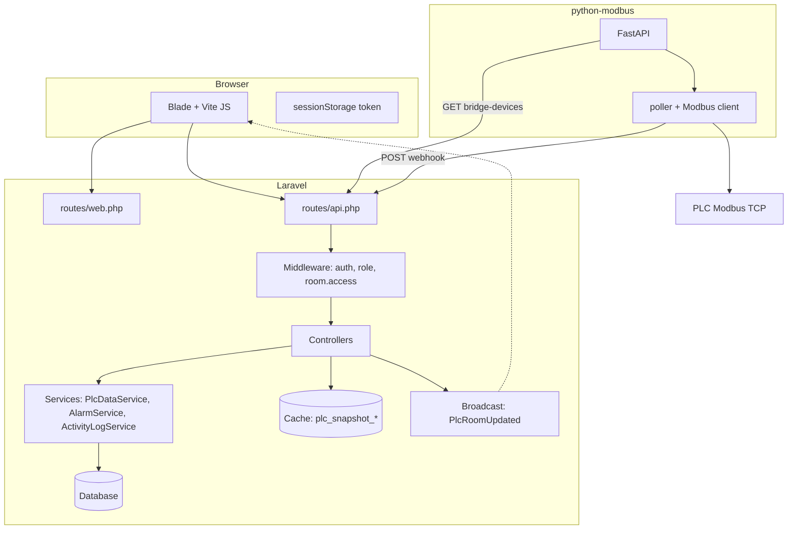
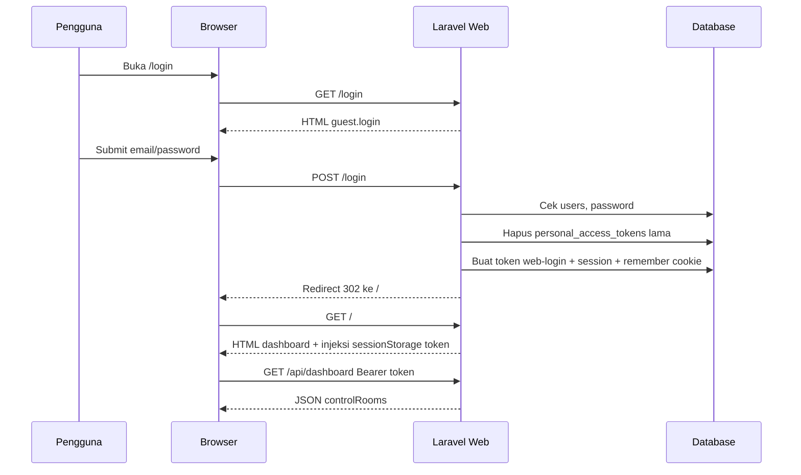
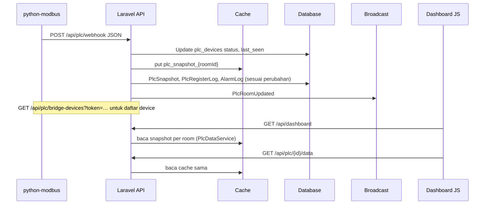
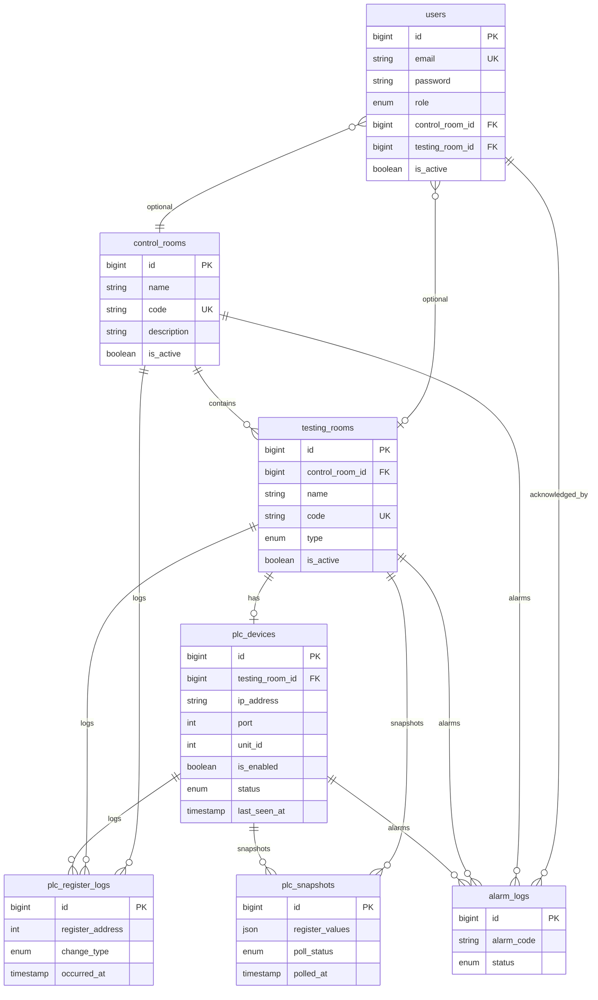

# Sistem dashboard monitoring testing bay — cara kerja & indeks file

Dokumen ini menjelaskan **cara kerja internal** (bukan hanya tampilan): alur login, isi sesi, pemanggilan API, data PLC, logout, serta **indeks file** di repositori agar perubahan fitur bisa **dicek silang** (cari rute → controller → service/model → view/JS).

**Cakupan:** aplikasi Laravel di root repositori, aset `resources/`, migrasi `database/`, dan service `**python-modbus/`**. Folder `vendor/`, `node_modules/`, build Vite di `public/build` adalah dependensi/build artefak — tidak diuraikan per file.

---

## 1. Gambaran arsitektur

---

## 2. Login web (sesi + token API untuk dashboard)

### 2.1 Urutan proses

1. Pengguna tamu membuka rute `GET /login` → `App\Http\Controllers\Web\Guest\AuthController::showLoginForm` → view `resources/views/guest/login.blade.php` (layout `resources/views/guest/layout.blade.php`).
2. Form `POST /login` → `AuthController::login` memvalidasi email/password, mencari `User` aktif, memverifikasi hash password.
3. **Sanctum:** semua token personal user lama dihapus (`$user->tokens()->delete()`), lalu dibuat token baru `createToken('web-login')` — plain text token disimpan sementara.
4. **Sesi web:** `Auth::login($user, remember)` + `$request->session()->put('api_token', $token)` menyimpan token di **session server** (driver sesi dari `.env`, tabel `sessions` jika `SESSION_DRIVER=database`).
5. Redirect `GET /` → `Web\DashboardController@index` → view `resources/views/shared/dashboard.blade.php`.
6. **Browser:** jika Blade punya `@if(session('api_token'))`, skrip inline menulis token ke `**sessionStorage`** kunci `spm_auth_token` (`resources/views/shared/dashboard.blade.php`). Ini dipakai `resources/js/services/authService.js` untuk header `Authorization: Bearer …` pada `fetch` ke `/api/*`.

### 2.2 Diagram urutan (login web)

### 2.3 File yang terlibat (login web)

| File                                                              | Peran                                                                                                         |
| ----------------------------------------------------------------- | ------------------------------------------------------------------------------------------------------------- |
| `routes/web.php`                                                  | Grup `guest`: `login` GET/POST; setelah auth redirect ke `dashboard` (`bootstrap/app.php`: `redirectUsersTo`) |
| `bootstrap/app.php`                                               | `redirectGuestsTo` → `login`; alias middleware `role`, `room.access`                                          |
| `app/Http/Controllers/Web/Guest/AuthController.php`               | Validasi, `Auth::login`, token Sanctum, `session('api_token')`                                                |
| `app/Models/User.php`                                             | `HasApiTokens`, relasi, `canAccessTestingRoomId`, `isAdmin`                                                   |
| `resources/views/guest/login.blade.php`                           | Form login                                                                                                    |
| `resources/views/guest/layout.blade.php`                          | Shell halaman tamu                                                                                            |
| `database/migrations/..._create_users_table.php`                  | Struktur `users`                                                                                              |
| `database/migrations/..._create_sessions_table.php`               | Penyimpanan sesi jika driver database                                                                         |
| `database/migrations/..._create_personal_access_tokens_table.php` | Token Sanctum                                                                                                 |
| `resources/views/shared/dashboard.blade.php`                      | Setelah login: injeksi `spm_auth_token`, `__SCADA_USER__`                                                     |
| `resources/js/services/authService.js`                            | Baca token, `apiFetch` / `apiJson`, hapus token & redirect ke `/login` jika 401                               |
| `config/auth.php`, `config/sanctum.php`                           | Guard, penyediaan token (sesuaikan jika ubah auth)                                                            |

**Catatan:** `app/Http/Requests/LoginRequest.php` ada di repo tetapi **tidak dipakai** oleh `Web\Guest\AuthController` (validasi inline `Request::validate`). Jika ingin satu sumber aturan validasi login web, bisa dihubungkan nanti.

---

## 3. Isi sistem setelah login (dashboard & data)

### 3.1 Muat halaman utama

1. `GET /` memuat Blade dashboard + Vite entry `resources/js/app.js`.
2. `app.js` memanggil `initDashboard()` dari `resources/js/dashboard/init.js`.
3. `getDashboardData()` (`resources/js/services/dashboardData.js`) memanggil `**GET /api/dashboard`** dengan Bearer token (kecuali mode dummy `VITE_DASHBOARD_USE_DUMMY=true` → data dari `resources/js/data/dummy.js`).
4. **Backend:** `routes/api.php` → middleware `auth:sanctum` → `App\Http\Controllers\Api\DashboardController` → `App\Services\PlcDataService::buildDashboardPayload($user)`.
5. `PlcDataService` membaca model `ControlRoom` / `TestingRoom` / `PlcDevice`, cache `plc_snapshot_{id}`, `AlarmLog`, log register untuk membentuk JSON `controlRooms` + `utilities` sesuai hak user (admin vs operator per-ruang vs operator/viewer per control room — lihat kode service).

### 3.2 Loop “hidup” di browser

`Main.startLiveLoop()` (`resources/js/dashboard/main.js`) menjalankan interval (`pollIntervalGlobalMs()`):

- Memanggil lagi `getDashboardData()` → menyegarkan `store.data`, membangun ulang sidebar alarm, utilitas.
- Jika panel ruang terbuka: `GET /api/plc/{room_id}/data` → `applySnapshotToRoom` / sinkron status poll (lihat komentar di `main.js`).

### 3.3 Peta 3D & interaksi

- `resources/js/three/scene.js` — adegan Three.js, label klik memanggil `openPanel` / `openRoomPanel` dari `main.js`.
- `resources/js/dashboard/state.js` — `store`, `ui`, pemetaan `ROOM_TO_CR`.

### 3.4 Realtime (opsional)

- Jika Echo + Pusher/Reverb dikonfigurasi (`VITE_PUSHER_`*, `BROADCAST_CONNECTION`), `bindPlcEchoForRoom` di `main.js` mendengarkan channel `plc.room.{roomId}`, event `PlcRoomUpdated` dari `App\Events\PlcRoomUpdated` (dipicu dari `Api\PlcController` setelah webhook).

### 3.5 File terlibat (inti dashboard)

| File                                               | Peran                                                   |
| -------------------------------------------------- | ------------------------------------------------------- |
| `routes/web.php`                                   | `GET /`, `settings/plc`, `account/password`, admin      |
| `routes/api.php`                                   | `GET /api/dashboard`, PLC, alarms, activity-logs, admin |
| `app/Http/Controllers/Web/DashboardController.php` | Mengembalikan view dashboard                            |
| `app/Http/Controllers/Api/DashboardController.php` | JSON dashboard                                          |
| `app/Services/PlcDataService.php`                  | Agregasi payload ruang + PLC + alarm                    |
| `resources/js/app.js`                              | Entry + `initDashboard`                                 |
| `resources/js/dashboard/init.js`                   | Urutan init UI + Three                                  |
| `resources/js/dashboard/main.js`                   | Sidebar, panel, polling, Echo, alarm                    |
| `resources/js/dashboard/state.js`                  | State global UI                                         |
| `resources/js/services/dashboardData.js`           | `getDashboardData`, `PlcAPI.getRoomData`                |
| `resources/js/three/scene.js`                      | Visualisasi 3D                                          |
| `resources/css/dashboard.css`                      | Gaya dashboard & settings                               |

---

## 4. Logout web

1. Form `POST /logout` (`partials/profile-menu.blade.php`) dengan `@csrf` + opsional `sessionStorage.removeItem('spm_auth_token')` di `onsubmit`.
2. `Web\Guest\AuthController::logout` — hapus semua token Sanctum user, `Auth::logout()`, `session()->invalidate()`, `regenerateToken()`, redirect `GET /login`.

**File:** `routes/web.php`, `AuthController.php`, `profile-menu.blade.php`, `authService.js` (token klien ikut dibersihkan dari submit form).

---

## 5. Login & logout API (klien non-browser / integrasi)

| Aksi   | Rute               | Controller                  | Catatan                                                           |
| ------ | ------------------ | --------------------------- | ----------------------------------------------------------------- |
| Login  | `POST /api/login`  | `Api\AuthController@login`  | Token nama `auth-token`; mengembalikan `user`, `accessible_rooms` |
| Logout | `POST /api/logout` | `Api\AuthController@logout` | `auth:sanctum`; menghapus **current** token saja                  |
| Profil | `GET /api/me`      | `Api\AuthController@me`     | Data user + ruang yang boleh diakses                              |

Tidak memakai session web; hanya header `Authorization: Bearer`.

---

## 6. Alur data PLC (ringkas sistemik)

**File utama:** `app/Http/Controllers/Api/PlcController.php` (webhook, bridge-devices, getRoomData, getRoomLogs, getAllRoomsData), `app/Services/PlcDataService.php`, `app/Events/PlcRoomUpdated.php`, `python-modbus/main.py`, `python-modbus/modbus/poller.py`, `python-modbus/modbus/device_loader.py`, `python-modbus/modbus/register_map.py`, `python-modbus/modbus/client.py`.

---

## 7. Middleware & akses

| Alias                   | Kelas                                      | Fungsi                                                                                     |
| ----------------------- | ------------------------------------------ | ------------------------------------------------------------------------------------------ |
| `auth` / `auth:sanctum` | Laravel                                    | Web: sesi; API: Bearer token                                                               |
| `role`                  | `App\Http\Middleware\RoleMiddleware`       | Membatasi aksi ke daftar peran (`admin`, `operator`, …)                                    |
| `room.access`           | `App\Http\Middleware\RoomAccessMiddleware` | Memastikan `room_id` di rute boleh diakses user non-admin (`User::canAccessTestingRoomId`) |

Daftar rute yang memakai middleware: `**routes/api.php`**, `**routes/web.php**` (grup `role:admin`).

---

## 8. ERD data (inti operasional)

Relasi mengikuti migrasi di `database/migrations/`. Tabel utilitas Laravel (`jobs`, `cache`, `sessions`, `password_reset_tokens` jika ada) tidak digambar detail di sini.

---

## 9. Indeks file aplikasi (`app/`)

Semua file PHP di bawah `app/` pada snapshot proyek ini:

| Path                                                        | Peran                                           |
| ----------------------------------------------------------- | ----------------------------------------------- |
| `Providers/AppServiceProvider.php`                          | Service provider utama                          |
| `Events/PlcRoomUpdated.php`                                 | Event broadcast setelah webhook                 |
| `Models/User.php`                                           | Pengguna, Sanctum, akses ruang                  |
| `Models/ControlRoom.php`                                    | Ruang kontrol                                   |
| `Models/TestingRoom.php`                                    | Ruang uji pit/cell                              |
| `Models/PlcDevice.php`                                      | Satu PLC per ruang uji                          |
| `Models/AlarmLog.php`                                       | Catatan alarm                                   |
| `Models/PlcRegisterLog.php`                                 | Log perubahan register                          |
| `Models/PlcSnapshot.php`                                    | Riwayat snapshot (persisten)                    |
| `Services/PlcDataService.php`                               | Bentuk payload dashboard & normalisasi data PLC |
| `Services/AlarmService.php`                                 | Layanan alarm (query/akses)                     |
| `Services/ActivityLogService.php`                           | Layanan log aktivitas                           |
| `Http/Controllers/Controller.php`                           | Base controller                                 |
| `Http/Middleware/RoleMiddleware.php`                        | Cek peran                                       |
| `Http/Middleware/RoomAccessMiddleware.php`                  | Cek akses `room_id`                             |
| `Http/Controllers/Web/Guest/AuthController.php`             | Login/logout web                                |
| `Http/Controllers/Web/DashboardController.php`              | Halaman `/`                                     |
| `Http/Controllers/Web/AccountPasswordController.php`        | Ganti password diri                             |
| `Http/Controllers/Web/Operator/PlcConnectionController.php` | Halaman & update settings PLC                   |
| `Http/Controllers/Web/Admin/OperatorController.php`         | CRUD operator (Blade admin)                     |
| `Http/Controllers/Web/Admin/ActivityLogController.php`      | Halaman log admin                               |
| `Http/Controllers/Api/AuthController.php`                   | Login/logout/me API                             |
| `Http/Controllers/Api/DashboardController.php`              | `GET /api/dashboard`                            |
| `Http/Controllers/Api/RoomController.php`                   | Daftar/detail ruang API                         |
| `Http/Controllers/Api/PlcController.php`                    | Webhook, bridge, data, log PLC                  |
| `Http/Controllers/Api/AlarmController.php`                  | Daftar alarm, ack, resolve                      |
| `Http/Controllers/Api/ActivityLogController.php`            | Log aktivitas API                               |
| `Http/Controllers/Api/Admin/UserController.php`             | CRUD user via API (admin)                       |
| `Http/Requests/LoginRequest.php`                            | **Belum terhubung** ke controller login         |

---

## 10. Rute & konfigurasi

| File                    | Isi                                                                                                                |
| ----------------------- | ------------------------------------------------------------------------------------------------------------------ |
| `routes/web.php`        | Web: login, logout, dashboard, password akun, settings PLC, grup `/admin/`*                                        |
| `routes/api.php`        | API publik: login, webhook, bridge-devices; grup Sanctum: dashboard, rooms, plc, alarms, activity-logs; grup admin |
| `routes/console.php`    | Perintah Artisan terjadwal (jika ada)                                                                              |
| `bootstrap/app.php`     | Routing, alias middleware, redirect guest/user                                                                     |
| `.env` / `.env.example` | Semua variabel lingkungan; komentar di `.env.example` menjelaskan PLC bridge & Vite                                |

---

## 11. Basis data & seed

| Lokasi                                | Isi                                                           |
| ------------------------------------- | ------------------------------------------------------------- |
| `database/migrations/*.php`           | Skema tabel (lihat juga komentar di dalam file migrasi)       |
| `database/seeders/DatabaseSeeder.php` | Data awal control room, testing room, plc_devices, users demo |

---

## 12. Sumber daya front-end & tampilan

| Lokasi                                              | Isi                                   |
| --------------------------------------------------- | ------------------------------------- |
| `resources/views/shared/dashboard.blade.php`        | Shell dashboard utama                 |
| `resources/views/partials/profile-menu.blade.php`   | Menu profil + logout                  |
| `resources/views/guest/*`                           | Login                                 |
| `resources/views/operator/plc-connection.blade.php` | Settings PLC                          |
| `resources/views/admin/*`                           | Operator admin, activity logs         |
| `resources/views/account/password-edit.blade.php`   | Form ganti password                   |
| `resources/js/app.js`                               | Entry Vite dashboard                  |
| `resources/js/bootstrap.js`                         | Bootstrap JS Laravel                  |
| `resources/js/profile-menu.js`                      | Dropdown profil                       |
| `resources/js/dashboard/*`                          | Logika dashboard                      |
| `resources/js/services/*`                           | Auth & data API                       |
| `resources/js/three/scene.js`                       | Peta 3D                               |
| `resources/js/data/dummy.js`                        | Data statis UI (hanya jika env dummy) |
| `resources/css/dashboard.css`                       | Gaya besar                            |

---

## 13. Service `python-modbus/`

| File / area               | Peran                                       |
| ------------------------- | ------------------------------------------- |
| `main.py`                 | Entry FastAPI                               |
| `config.py`               | Konfigurasi perangkat fallback              |
| `modbus/device_loader.py` | Muat daftar device dari Laravel atau config |
| `modbus/poller.py`        | Siklus polling                              |
| `modbus/client.py`        | Modbus TCP                                  |
| `modbus/register_map.py`  | Peta register 40001–40012                   |

---

## 14. Dokumen lain di repo

| File                                   | Fokus                                                                                                                       |
| -------------------------------------- | --------------------------------------------------------------------------------------------------------------------------- |
| `README.md`                            | Gambaran produk & cara jalan cepat                                                                                          |
| `docs/PANDUAN_MENJALANKAN_SISTEM.md`   | Langkah operasional menyeluruh                                                                                              |
| `docs/PENJELASAN_CARA_KERJA_SISTEM.md` | Penjelasan alur (tumpang tindih sebagian dengan dokumen ini; dokumen **ini** menekankan indeks file + diagram login/logout) |
| `ROADMAP-SCADA.md`                     | Rencana fitur                                                                                                               |

---

## 15. Cara memakai dokumen ini saat ada perubahan

1. **Ubah alur login / token** → mulai dari `routes/web.php` + `Web\Guest\AuthController` + `dashboard.blade.php` + `authService.js`.
2. **Ubah payload dashboard** → `PlcDataService` + `Api\DashboardController` + `dashboardData.js` + `state.js` / `main.js`.
3. **Ubah aturan siapa boleh lihat ruang** → `User::canAccessTestingRoomId` + `RoomAccessMiddleware` + `routes/api.php`.
4. **Ubah cara PLC masuk** → `PlcController` webhook + `python-modbus` + event `PlcRoomUpdated`.
5. **Ubah skema DB** → migrasi baru + model terkait + `PlcDataService` / controller yang membaca kolom tersebut.

---

*Dokumen ini disusun agar selaras dengan kode di repositori; jika perilaku berbeda, utamakan kode sumber.*